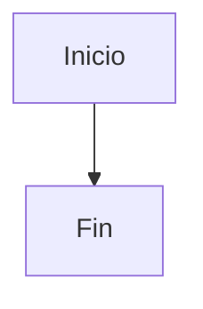

##Sistema de Gestión de Biblioteca 
Taller 1 - Programación de Computadores III - UPC 
## Autor 
[Hector Jose Guevara Quintero] - [1067602882] 
## Descripción 
Aplicación de consola en Java para gestionar clientes, libros y préstamos 
de una biblioteca. Almacenamiento en memoria (ArrayList). 
## Cómo ejecutar 
1. Abrir el proyecto en NetBeans 
2. Compilar con Maven 
3. Ejecutar Main.java 
## Funcionalidades - CRUD de Clientes - CRUD de Libros - Registro de préstamos y devoluciones

graph TD

    %% Capa de Interfaz de Usuario
    subgraph UI ["Capa de Interfaz de Usuario (ui)"]
        ConsoleMenu["ConsoleMenu / MainApp <i>(Líder Técnico)</i>"]
    end

    %% Capa de Servicios
    subgraph Service ["Capa de Servicios (service)"]
        PersonService["PersonService <i>(Desarrollador 2)</i>"]
        SaleService["SaleService <i>(Líder Técnico)</i>"]
        ProductService["ProductService <i>(Desarrollador 1)</i>"]
    end

    %% Capa de Persistencia
    subgraph Persistence ["Capa de Persistencia (persistence)"]
        SaleRepository["SaleRepository <i>(Líder Técnico)</i>"]
        PersonRepository["PersonRepository <i>(Desarrollador 2)</i>"]
        ProductRepository["ProductRepository <i>(Desarrollador 1)</i>"]
    end

    %% Capa de Modelo
    subgraph Model ["Capa de Modelo (model)"]
        
        subgraph ModVentas ["Módulo de Ventas (Líder Técnico)"]
            Sale["Sale"]
        end
        
        subgraph ModPersonas ["Módulo de Personas (Desarrollador 2)"]
            Person["«abstract» Person"]
            Customer["Customer"]
            Seller["Seller"]
        end
        
        subgraph ModProductos ["Módulo de Productos (Desarrollador 1)"]
            Product["«abstract» Product"]
            VideoGame["VideoGame"]
            Console["Console"]
        end
        
    end

    %% Relaciones desde UI
    ConsoleMenu --> PersonService
    ConsoleMenu --> SaleService
    ConsoleMenu --> ProductService

    %% Relaciones desde Service
    PersonService --> PersonRepository
    PersonService --> Person

    SaleService --> SaleRepository
    SaleService -.-> ProductService
    SaleService --> Sale
    SaleService --> Person
    SaleService --> Customer
    SaleService --> Seller
    SaleService --> Product

    ProductService --> ProductRepository
    ProductService --> Product

    %% Relaciones desde Persistence
    SaleRepository --> Sale
    PersonRepository --> Person
    ProductRepository --> Product
